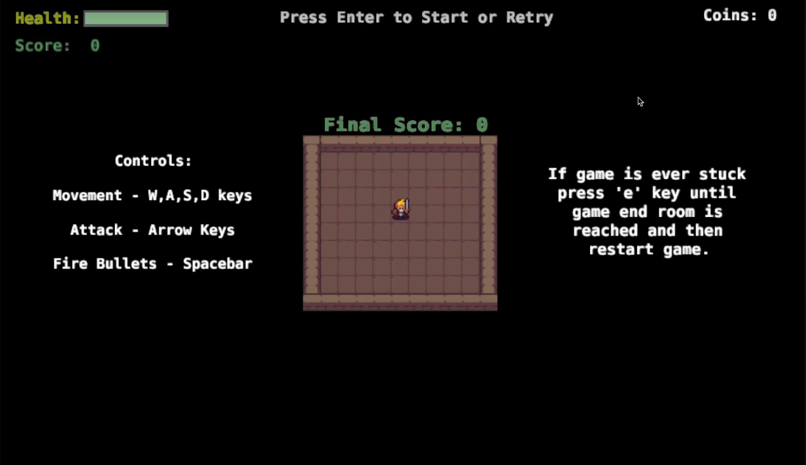
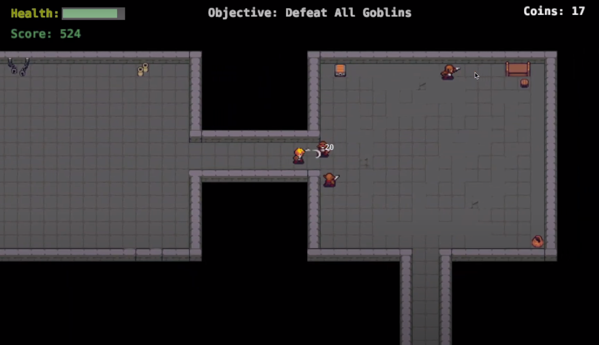
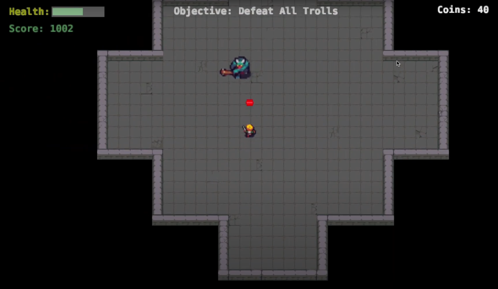

# Defold Game Project - Dungeon Escape

A simple dungeon crawler game developed using Defold game engine and Lua for macOS. I created this game for my major project for Software Design & Development in year 12.

# Gameplay Demonstration
A demonstration of the gameplay can be viewed here: https://www.youtube.com/watch?v=CKmX_XqqAU4&ab_channel=NathanNguyen

# Description
Inspired by games like "The Binding of Isaac", this project has players navigate through different levels of a dungeon, fighting enemies with a sword and lasers.

# Technologies Used
Game Engine: Defold  
Language: Lua  

# Controls
Move: WASD  
Swing Sword: Arrow Keys  
Shoot Laser: Spacebar

# Screenshots

 
